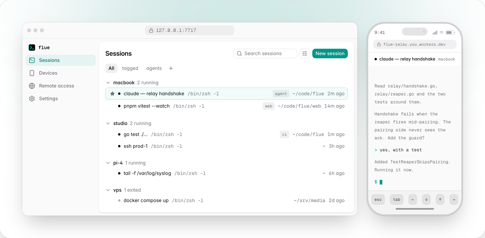
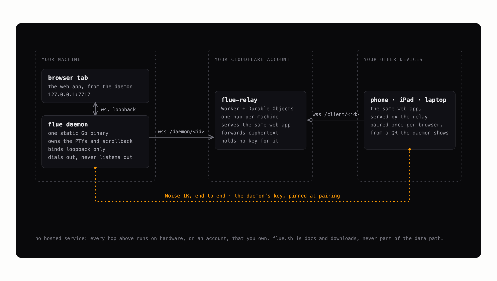

<h1 align="center">flue</h1>

<p align="center"><strong>Continue your Claude Code and Codex sessions on any screen.</strong></p>

<p align="center">
  <a href="https://github.com/karnstack/flue/actions/workflows/ci.yml"></a>
  <a href="https://github.com/karnstack/flue/releases/latest"></a>
  <a href="LICENSE"></a>
</p>

<p align="center">
  <a href="https://flue.sh">flue.sh</a> ·
  <a href="https://flue.sh/docs/setup">setup</a> ·
  <a href="https://flue.sh/docs/how-it-works">how it works</a> ·
  <a href="https://flue.sh/docs/relay">remote access</a> ·
  <a href="https://flue.sh/docs/faq">faq</a>
</p>

<p align="center">
  <picture>
    <source media="(prefers-color-scheme: dark)" srcset="docs/hero-dark.png">
    
  </picture>
</p>

Start on your laptop. Check in from your phone or iPad. Pick up again at your
desk. The shell stays on the machine; flue moves the view.

A small Go daemon holds the shells and their scrollback, and a web app draws
them. Closing the tab does not kill a session. It only detaches it: the agent
keeps working, the build keeps running, the SSH session stays up, and
reattaching replays what you missed.

- **Sessions outlive the tab.** Close it and the build keeps running.
- **One list, every machine.** Name, tag, pin, group and search the whole
  fleet from one place. Hover a session to see what it is doing.
- **One keystroke to any of them.** `⌘K`, or `Ctrl+Shift+K` anywhere, opens
  every session on every machine. The highlighted row shows its own last
  fourteen lines, so you can see which one is the build. `Ctrl+Shift+1` to `9`
  jumps to a pinned session.
- **Reachable from anything you own.** Pair a phone with a QR code, once for
  the whole fleet. Two devices on one session mirror live, and the size follows
  whichever view you are using.
- **No hosted service.** Remote access runs through a relay you deploy into
  your own Cloudflare account, end-to-end encrypted, with the daemon's key
  pinned at pairing. flue.sh is a landing page and is never part of the data
  path.

One static Go binary. macOS, Linux, WSL. No Node, no Python, no toolchain.

## Install

```sh
brew install karnstack/tap/flue    # or: curl -fsSL https://flue.sh/install.sh | sh
flue enable
```

`flue enable` installs a login service, starts the daemon, and opens the UI.
On Linux it also runs `loginctl enable-linger`, so the daemon and your sessions
survive your last logout. If lingering cannot be turned on, which happens in
some containers, `flue enable` warns you and names the command to run.
Everything after that happens in the browser.

## Recommended setup

One relay, every machine joined to it, every device paired once.

1. Install flue and run `flue enable` on every machine that runs work: the
   laptop, the desktop, the Pi, the VPS.
2. Run `flue relay setup` **once**, on one machine. Running it again does not
   add a relay, it replaces the one you have: every machine then has to re-join
   with the newly printed line, and every device has to pair again.
3. Run the `flue relay join` line it prints on every other machine.
4. Pair each phone or tablet once, from a QR code. That pairing covers the
   whole fleet, so there is no second ceremony per machine. It is per browser,
   so Safari and Chrome on one iPad pair separately.

Long jobs belong on a machine that stays on. A sleeping laptop's sessions are
not lost, but nothing runs until it wakes.

The full version is at [flue.sh/docs/setup](https://flue.sh/docs/setup).

## Sessions outlive flue

Every session runs in its own small holder process, not inside the daemon.
Updating flue, restarting it, even the daemon crashing outright: the shells
and agents keep running, and the next daemon picks them back up with their
scrollback where you left it. A machine reboot is the one thing that ends a
session, and even then flue brings it back with its history, a fresh shell,
and the command that resumes the agent conversation it was in.

## The CLI

```
flue enable        # install the login service, start the daemon, open the UI
flue disable       # remove it
flue status        # daemon, login service, and session diagnostics
flue open [path]   # spawn a session here, handy from a shell prompt
flue relay setup   # deploy a relay to your own Cloudflare account
flue relay join    # point this machine at a relay another machine deployed
flue relay status  # show the configured relay
flue relay update  # redeploy this release's relay; secret and pairings kept
flue relay address # repoint this machine at a custom domain on the same relay
flue relay leave   # take this machine off its relay; the Worker stays deployed
flue serve         # run the daemon in the foreground, no login service
flue update        # download the newest release, swap this binary, restart the daemon
flue version       # print the version (also --version, -v)
```

## Remote access

The daemon listens on loopback and nothing else, so reaching it from somewhere
else is opt-in and takes one command:

```sh
flue relay setup                                                 # machine 1: paste a Cloudflare token
flue relay join wss://<your-relay> --secret <...> --fleet <...>  # every other machine
```

That deploys a Worker **and** this web app into your own Cloudflare account,
on the free plan. The same deploy is a card on the UI's Remote screen. One
relay fronts every machine you own, and pairing a device covers the whole
fleet rather than one machine.

What it deploys and what it costs is at
[flue.sh/docs/relay](https://flue.sh/docs/relay), with the operator-grade
version in [docs/RELAY.md](docs/RELAY.md). What a hostile relay origin could do
despite the end-to-end encryption, which is the honest version because the
browser loads its JavaScript from that origin, is in the
[FAQ](https://flue.sh/docs/faq) and at length in [docs/faq.md](docs/faq.md).

<p align="center">
  
</p>

## Status

Released and in daily use. v0.5.1 is the current release, `brew install
karnstack/tap/flue` gets it, and the whole of it works: the local terminal, the
login service, the fleet-wide sessions list, pairing, and the Cloudflare relay.
The relay has been through its manual end-to-end gate
([docs/RELAY.md](docs/RELAY.md)) against a real account, with a phone on a
different network paired to it and a second machine joined to the same relay.
There is a recording of that run at
[flue.sh/docs/setup](https://flue.sh/docs/setup).

It is 0.x, which means what it usually means: commands, flags and the config
file can still change between releases, and an upgrade may ask something of
you. Known rough edges live in [docs/FOLLOW-UPS.md](docs/FOLLOW-UPS.md).

flue is open source and always free.

## Building and developing

```sh
mise install   # go, node, pnpm, pinned in mise.toml
make build     # web UI + relay Worker, embedded, into bin/flue
make test
```

The dev loop, the dev/prod split, and working on the relay are in
[docs/DEVELOPMENT.md](docs/DEVELOPMENT.md). The landing site is its own package
under [site/](site/), and `make site-dev` runs it.

## License

[MIT](LICENSE)

